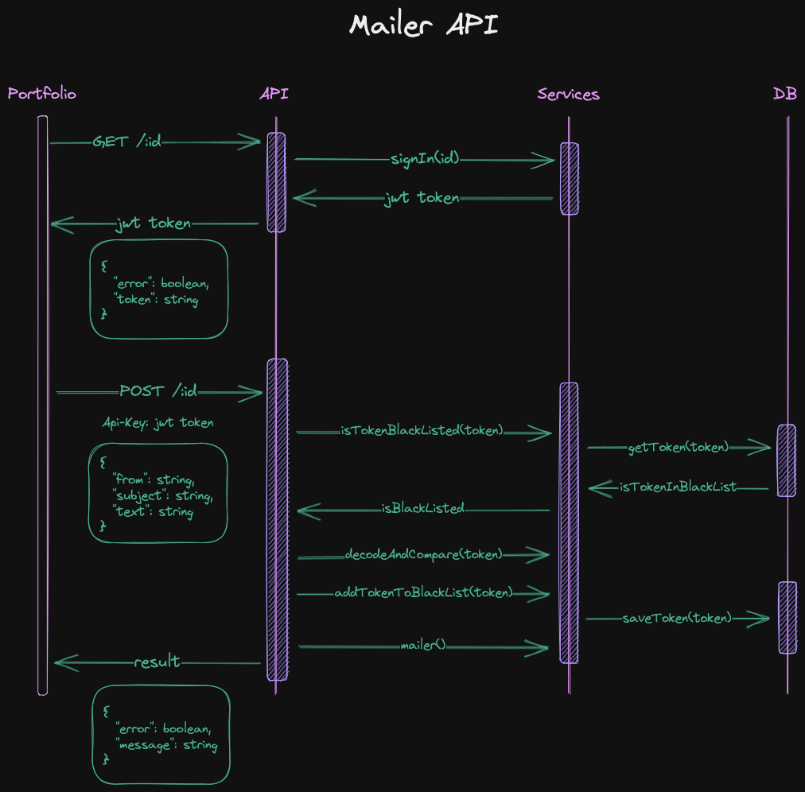

# Mailer

A minimal server to mail myself from my portfolio built with Fastify and Redis. It follows the following flow:

## Pre requisites

Create a `.env` file that contains the same keys that are shown in the `.env.example` file.

## Installation

Run `pnpm i`.
